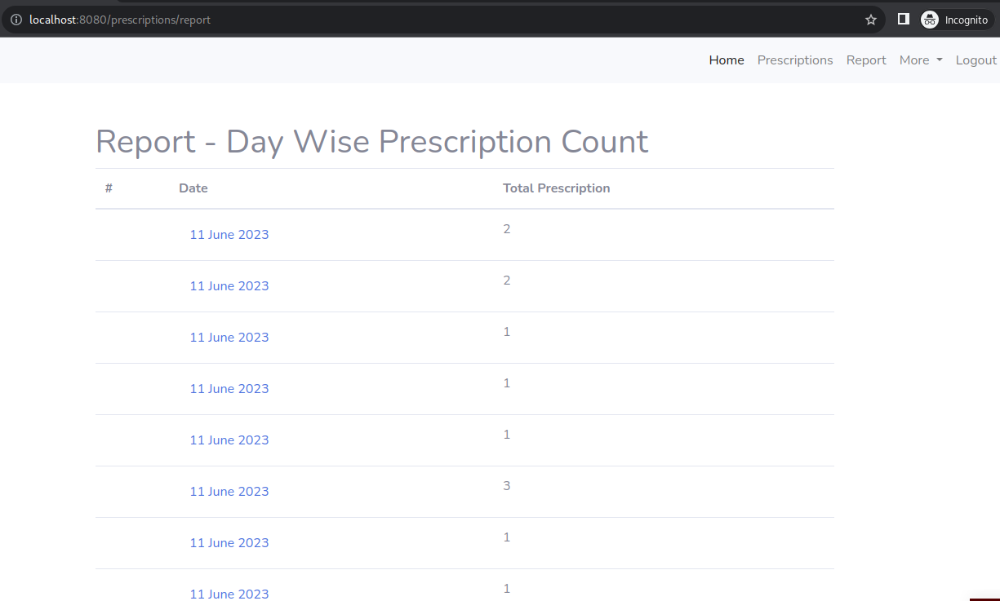
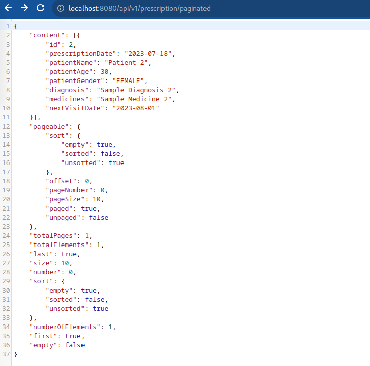

# Prescription Generation Application

A simple prescription generation application using Spring Boot-3.1.1 and Java-20.

## Features

- All users must be authenticated to use this application. If not, they will be redirected to the login page.
- After login, the application redirects to the prescription list page. By default, it shows the prescriptions for the current month. However, users can choose to view all prescriptions or prescriptions within a date range.
- Users can create prescriptions with both front-end and back-end validation.
- Users can edit existing prescriptions.
- Users have the option to delete prescriptions, with a browser alert confirming the action.
- A report page shows users with a date-wise prescription count and user can see date-wise prescription list.
- The application includes a REST API that allows authenticated users to retrieve all prescriptions at once or in a paginated manner.
- The application also consumes NLM (National Library of Medicine) REST API from the back-end and displays the data in a tabular format on the front-end.

## Extras

- The user interface utilizes Bootstrap, making it responsive and user-friendly.
- Front-end form validation ensures data integrity and improves user experience.

## Screenshots

- ## User Login

- ## Prescription List

- ## Create New Prescription

- ## Prescription Details

- ## Edit Existing Prescription

- ## Delete Prescription Alert

- ## Day Wise Prescription Report

- ## API Endpoint to retrieve all prescriptions

- ## Consume NLM REST API

